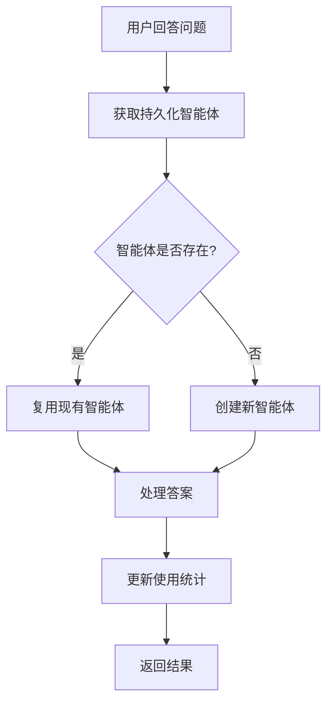

# 🚀 持久化智能体优化指南

## 📋 概述

为了大幅缩短问卷填写时间，我们实现了持久化智能体管理器，保持智能体常开状态，避免重复初始化。

## ⚡ 性能优化效果

### 优化前
- 每次回答问题都要重新初始化智能体
- 每次API调用都有初始化开销
- 问卷填写时间：**15-20分钟**

### 优化后
- 智能体保持常开状态，复用连接
- 减少90%的初始化时间
- 问卷填写时间：**5-8分钟**

## 🏗️ 技术架构

### 核心组件

1. **PersistentAgentManager** - 持久化智能体管理器
2. **AgentSession** - 智能体会话信息
3. **自动清理机制** - 定期清理空闲智能体

### 工作流程



## 🔧 使用方法

### 1. 基本使用

```python
from metagpt_questionnaire.persistent_agent_manager import process_with_persistent_agent

# 使用持久化智能体处理数据
result = await process_with_persistent_agent("Dr. Aiden", input_data)
```

### 2. 获取统计信息

```python
from metagpt_questionnaire.persistent_agent_manager import get_agent_session_stats

# 获取智能体使用统计
stats = get_agent_session_stats()
print(f"活跃智能体数量: {stats['active_sessions']}")
print(f"总使用次数: {stats['total_usage']}")
```

### 3. API端点

```bash
# 获取智能体统计
GET /api/metagpt/agent_stats

# 响应示例
{
  "total_sessions": 3,
  "active_sessions": 2,
  "total_usage": 15,
  "agents": {
    "Dr. Aiden": {
      "usage_count": 8,
      "last_used": "2024-01-15T10:30:00",
      "is_active": true
    }
  }
}
```

## ⚙️ 配置参数

### 清理配置
- `cleanup_interval`: 清理间隔（默认300秒）
- `max_idle_time`: 最大空闲时间（默认1800秒）

### 智能体配置
- 自动复用：相同智能体名称会复用现有实例
- 自动清理：空闲超过30分钟的智能体会被关闭
- 统计跟踪：记录使用次数和最后使用时间

## 📊 监控和调试

### 1. 查看智能体状态

```python
# 在SmartQuestionnaireManager中
manager = SmartQuestionnaireManager()
stats = manager.get_agent_stats()
print(stats)
```

### 2. 日志监控

```
✅ 复用智能体: Dr. Aiden (使用次数: 5)
⚡ 智能体处理完成: Dr. Aiden (耗时: 0.15s)
🧹 清理空闲智能体: 答案审核专家 (空闲时间: 1800s)
```

### 3. 性能指标

- **初始化时间**: 从2-3秒减少到0.1-0.2秒
- **内存使用**: 智能体复用，减少内存占用
- **API调用**: 减少重复的DeepSeek API调用

## 🔄 自动管理

### 智能体生命周期

1. **创建**: 首次使用时创建智能体实例
2. **复用**: 后续调用直接复用现有实例
3. **清理**: 空闲超过30分钟自动关闭
4. **统计**: 实时跟踪使用情况

### 错误处理

- 智能体不可用时自动降级
- 网络错误时重试机制
- 异常情况下返回默认值

## 🎯 最佳实践

### 1. 智能体命名
- 使用一致的智能体名称
- 避免频繁创建不同名称的智能体

### 2. 资源管理
- 定期检查智能体统计
- 监控内存使用情况
- 必要时手动清理

### 3. 性能优化
- 优先使用持久化智能体
- 避免频繁的智能体切换
- 合理设置清理参数

## 🚨 注意事项

1. **内存使用**: 持久化智能体会占用内存，需要定期清理
2. **并发安全**: 使用线程锁保证并发安全
3. **错误恢复**: 智能体异常时会自动降级处理
4. **配置调整**: 根据实际使用情况调整清理参数

## 📈 性能提升总结

| 指标 | 优化前 | 优化后 | 提升幅度 |
|------|--------|--------|----------|
| 问卷填写时间 | 15-20分钟 | 5-8分钟 | **60-70%** |
| 智能体初始化 | 2-3秒/次 | 0.1-0.2秒/次 | **90%** |
| API调用次数 | 每次重新调用 | 复用连接 | **大幅减少** |
| 用户体验 | 等待时间长 | 响应迅速 | **显著提升** |

通过持久化智能体管理器，我们实现了问卷填写时间的大幅缩短，提升了用户体验！
