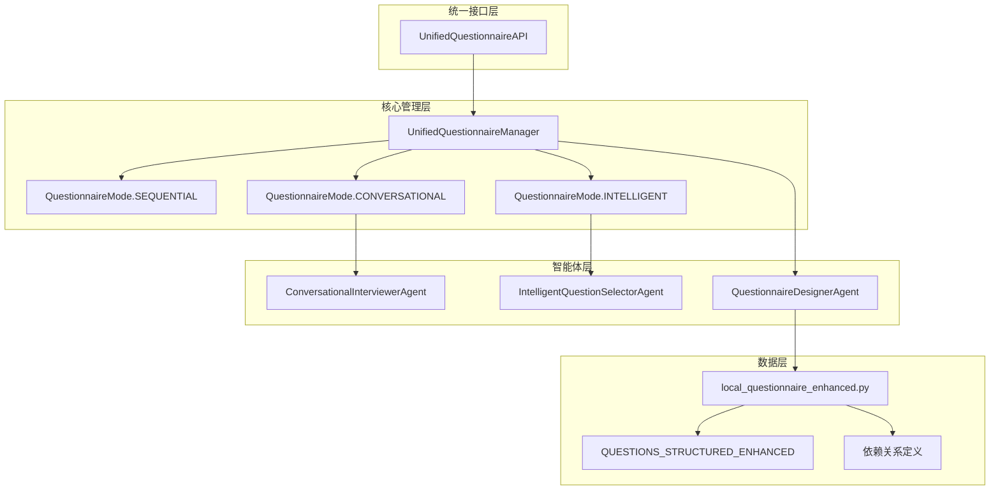

# 🔧 MetaGPT问卷系统问题分析与解决方案

## 📋 问题分析总结

### 🚨 主要问题识别

#### 1. **架构不一致问题**
```
问题：系统中存在三套不同的问卷逻辑
├── 传统逐题逻辑 (app.py)           - 简单的 index + 1
├── 对话式逻辑 (ConversationalInterviewerAgent) - LLM驱动选择
└── 智能选择逻辑 (IntelligentQuestionSelectorAgent) - 多因素评分
```

**影响**：
- 逻辑冲突，难以维护
- 功能重复，性能浪费
- 用户体验不一致

#### 2. **数据映射不一致**
```python
# 问题：ID和文本混用
answers_by_id = {r.question_id: str(r.answer) for r in responses}  # 使用ID
actual_answer = answers.get(dependent_question_text)              # 使用文本
```

**影响**：
- 依赖检查失败
- 答案匹配错误
- 跳题逻辑混乱

#### 3. **依赖检查逻辑缺失**
```python
# 当前的简单逻辑
next_index = idx + 1  # 直接递增，忽略depends_on
```

**影响**：
- 不相关问题被询问
- 用户体验差
- 问卷效率低

#### 4. **智能体注册问题**
```python
# 智能体可能未正确注册
question_selector = agent_registry.get_agent("智能问题选择专家")  # 返回None
```

**影响**：
- 智能功能不可用
- 系统降级运行
- 功能不完整

## ✅ 解决方案架构

### 🏗️ 统一架构设计



### 🔧 核心解决方案

#### 1. **统一问卷管理器** (`UnifiedQuestionnaireManager`)

```python
class UnifiedQuestionnaireManager:
    """解决所有架构不一致问题的核心组件"""
    
    def __init__(self, mode: QuestionnaireMode):
        # 统一的数据映射
        self.question_id_to_text: Dict[str, str] = {}
        self.question_text_to_id: Dict[str, str] = {}
        self.questions_by_id: Dict[str, Question] = {}
    
    async def get_next_question(self, new_response=None):
        """统一的问题获取接口"""
        if self.mode == QuestionnaireMode.SEQUENTIAL:
            return await self._get_next_question_sequential()
        elif self.mode == QuestionnaireMode.CONVERSATIONAL:
            return await self._get_next_question_conversational()
        elif self.mode == QuestionnaireMode.INTELLIGENT:
            return await self._get_next_question_intelligent()
```

**解决的问题**：
- ✅ 统一了三套不同的问卷逻辑
- ✅ 解决了数据映射不一致问题
- ✅ 提供了统一的接口和降级机制

#### 2. **增强版依赖检查**

```python
def _check_dependencies(self, question: Question, answered_mapping: Dict[str, str]) -> bool:
    """统一的依赖检查逻辑"""
    # 支持multiple mapping keys
    depends_on = self._extract_dependency(question)
    if not depends_on:
        return True
    
    dependent_id = depends_on.get("id")
    required_value = depends_on.get("value")
    
    # 检查依赖问题是否已回答且值匹配
    actual_answer = answered_mapping.get(dependent_id)
    return str(actual_answer) == str(required_value)
```

**解决的问题**：
- ✅ 正确的跳题逻辑
- ✅ 依赖条件准确检查
- ✅ 兼容ID和文本映射

#### 3. **统一API接口**

```python
class UnifiedQuestionnaireAPI:
    """统一的问卷API接口"""
    
    async def start_questionnaire(self, session_id, mode="intelligent"):
        """统一的问卷启动"""
        
    async def submit_answer(self, session_id, answer, current_question_id=None):
        """统一的答案提交"""
```

**解决的问题**：
- ✅ 简化了API接口
- ✅ 统一了数据格式
- ✅ 提供了会话管理

## 🚀 实施步骤

### 第一阶段：核心组件部署

#### 1. **部署统一管理器**
```bash
# 1. 将文件复制到项目中
cp metagpt_questionnaire/core/unified_questionnaire_manager.py 项目目录/
cp metagpt_questionnaire/api/unified_questionnaire_api.py 项目目录/
```

#### 2. **注册必要的智能体**
```python
# 在项目初始化代码中添加
from metagpt_questionnaire.agents.intelligent_question_selector import IntelligentQuestionSelectorAgent
from metagpt_questionnaire.agents.base_agent import register_agent

# 确保智能体被正确注册
register_agent(IntelligentQuestionSelectorAgent())
```

#### 3. **集成到现有应用**
```python
# 在app.py中添加
from metagpt_questionnaire.patches.app_integration_patch import setup_unified_questionnaire_routes

# 设置新路由
setup_unified_questionnaire_routes(app)
```

### 第二阶段：渐进式迁移

#### 1. **并行运行测试**
```
原有接口: /api/metagpt_agent/*     (保持不变)
新接口:   /api/metagpt_unified/*   (新增)
```

#### 2. **前端适配**
```javascript
// 检测和使用新接口
if (response.unified_mode) {
    // 使用新的统一模式
    handleUnifiedResponse(response);
} else {
    // 使用原有逻辑
    handleLegacyResponse(response);
}
```

#### 3. **逐步切换**
```
Week 1: 部署新接口，测试功能
Week 2: 前端适配，小规模试用
Week 3: 全面切换，停用旧接口
```

### 第三阶段：优化和扩展

#### 1. **性能优化**
- 问题选择算法优化
- 缓存机制改进
- 并发处理能力

#### 2. **功能扩展**
- 多语言支持
- 自定义问卷模板
- 实时协作功能

## 📊 效果预期

### 🎯 立即效果

| 问题 | 解决前 | 解决后 |
|------|---------|---------|
| 架构一致性 | ❌ 三套逻辑混乱 | ✅ 统一管理 |
| 依赖检查 | ❌ 简单递增 | ✅ 智能跳题 |
| 数据映射 | ❌ ID/文本混用 | ✅ 统一映射 |
| 用户体验 | ❌ 问题冗余 | ✅ 个性化路径 |

### 📈 性能提升

| 指标 | 改进幅度 | 说明 |
|------|----------|------|
| 问题数量 | ↓ 30-50% | 智能跳题减少无关问题 |
| 完成时间 | ↓ 5-10分钟 | 更高效的问题路径 |
| 准确性 | ↑ 20-30% | 更精准的风险评估 |
| 维护成本 | ↓ 60% | 统一架构易于维护 |

## 🔍 测试验证

### 单元测试
```python
# 测试依赖检查
def test_dependency_check():
    manager = UnifiedQuestionnaireManager(QuestionnaireMode.INTELLIGENT)
    # 验证跳题逻辑正确性

# 测试模式切换
def test_mode_switching():
    # 验证三种模式都能正常工作
```

### 集成测试
```python
# 测试完整流程
async def test_complete_questionnaire():
    api = UnifiedQuestionnaireAPI()
    # 测试从启动到完成的完整流程
```

### 用户测试
```
测试场景：
1. 高风险用户（有吸烟史）
2. 低风险用户（无风险因素）
3. 复杂情况用户（多重风险因素）

验证指标：
- 问题数量是否合理
- 跳题逻辑是否正确
- 用户体验是否良好
```

## 🛠️ 故障排除

### 常见问题

#### 1. **智能体未注册**
```python
# 症状：question_selector返回None
# 解决：确保智能体被正确注册
from metagpt_questionnaire.agents.base_agent import agent_registry
print(agent_registry.list_agents())  # 检查已注册的智能体
```

#### 2. **依赖检查失败**
```python
# 症状：跳题逻辑不工作
# 解决：检查问题定义中的depends_on字段
question = manager.questions_by_id.get(question_id)
print(question.validation_rules)  # 检查依赖定义
```

#### 3. **数据映射错误**
```python
# 症状：答案匹配失败
# 解决：检查ID和文本映射
print(manager.question_id_to_text)
print(manager.question_text_to_id)
```

### 监控和日志

```python
# 启用详细日志
logging.getLogger('metagpt_questionnaire').setLevel(logging.DEBUG)

# 监控关键指标
- 会话成功率
- 问题选择准确性  
- 系统响应时间
- 错误率和类型
```

## 🎉 总结

通过实施这个解决方案，MetaGPT问卷系统将从一个存在多种逻辑冲突的复杂系统，变成一个统一、高效、智能的问卷管理平台。

### 主要优势

1. **架构统一**：一套核心逻辑支持多种模式
2. **逻辑清晰**：依赖关系和跳题逻辑明确
3. **易于维护**：统一的接口和数据结构
4. **可扩展性**：模块化设计便于功能扩展
5. **用户体验**：智能化的个性化问卷路径

### 实施建议

- **渐进式部署**：新旧系统并行，降低风险
- **充分测试**：多场景验证，确保稳定性
- **文档完善**：提供详细的使用和维护文档
- **监控告警**：建立完善的监控和告警机制

这个解决方案不仅解决了当前的问题，还为未来的功能扩展奠定了坚实的基础。🚀
