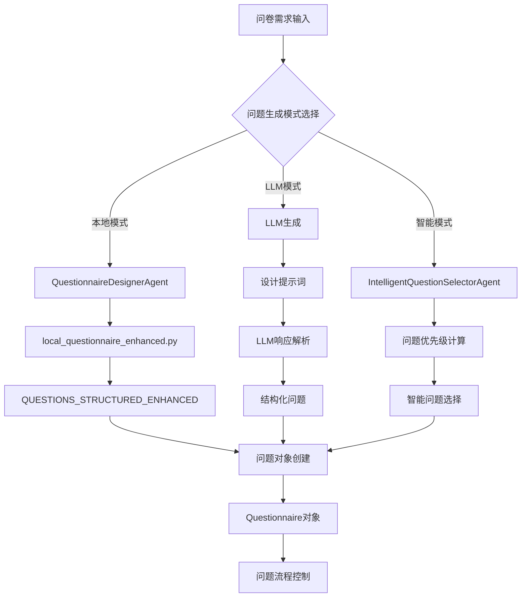

# 📋 MetaGPT问卷系统问题生成机制分析

## 🎯 概述

MetaGPT问卷系统采用了**多层次、智能化**的问题生成机制，能够根据不同的需求和场景动态生成问题。系统支持三种主要模式：**本地问卷模式**、**LLM生成模式**和**智能选择模式**。

## 🏗️ 问题生成架构



## 🔧 核心组件分析

### 1. **问卷设计器** (`QuestionnaireDesignerAgent`)

#### 主要功能
- 负责问卷的整体设计和问题生成
- 支持多种数据源：本地问卷、LLM生成、模板生成
- 处理问题依赖关系和验证规则

#### 问题生成流程
```python
async def design_questionnaire(self, requirements: Dict[str, Any]) -> Questionnaire:
    """设计问卷的主要流程"""
    
    # 1. 检查数据源类型
    source = requirements.get('source') or requirements.get('template_type')
    
    if source == 'local':
        # 本地问卷模式 - 从local_questionnaire_enhanced.py加载
        questionnaire = self._create_from_local_questionnaire(local_path)
    else:
        # LLM生成模式
        prompt = self.get_prompt("questionnaire_design", ...)
        llm_response = await self.call_llm(prompt)
        questionnaire_data = self._parse_llm_response(llm_response)
        questionnaire = self._create_questionnaire_from_data(questionnaire_data)
    
    # 2. 验证问卷完整性
    self._validate_questionnaire(questionnaire)
    
    return questionnaire
```

#### 本地问卷加载机制
```python
def _create_from_local_questionnaire(self, local_path: Optional[str] = None) -> Questionnaire:
    """从本地问卷定义构建问卷"""
    
    # 1. 导入本地模块
    module = self._import_local_questionnaire(local_path)
    
    # 2. 优先读取增强版问卷定义
    questions_structured = (
        getattr(module, 'QUESTIONS_STRUCTURED_ENHANCED', None) or 
        getattr(module, 'questions_structured', None) or 
        getattr(module, 'QUESTIONS_STRUCTURED', None)
    )
    
    # 3. 处理依赖关系
    for question_data in questions_structured:
        if 'depends_on' in question_data:
            # 将依赖信息注入到验证规则中
            question.validation_rules = {
                'depends_on': question_data['depends_on']
            }
    
    return questionnaire
```

### 2. **智能问题选择器** (`IntelligentQuestionSelectorAgent`)

#### 核心功能
- 基于用户回答和对话上下文智能选择下一个问题
- 实现问题优先级评分系统
- 支持条件跳题和动态问题流程

#### 问题选择算法
```python
async def select_next_question(self, answered_questions, available_questions, ...):
    """智能选择下一个问题"""
    
    # 1. 分析对话上下文
    context_analysis = self._analyze_conversation_context(
        answered_questions, conversation_history, user_profile
    )
    
    # 2. 计算每个问题的优先级分数
    question_scores = []
    for question in available_questions:
        score = await self._calculate_question_priority_score(
            question, context_analysis, answered_questions
        )
        question_scores.append((question, score))
    
    # 3. 按分数排序，选择最高分的问题
    question_scores.sort(key=lambda x: x[1], reverse=True)
    
    return question_scores[0][0]  # 返回最高分的问题
```

#### 优先级评分系统
```python
def _calculate_question_priority_score(self, question, context, answered_questions) -> float:
    """计算问题优先级分数"""
    
    # 1. 获取基础优先级
    category = question.category
    base_config = self.question_priorities.get(category, {"base_priority": 50, "urgency_multiplier": 1.0})
    base_score = base_config["base_priority"]
    urgency_multiplier = base_config["urgency_multiplier"]
    
    adjustment_factors = 1.0
    
    # 2. 检查依赖条件
    if question.validation_rules and 'depends_on' in question.validation_rules:
        dependency = question.validation_rules['depends_on']
        if not self._is_dependency_met(dependency, answered_questions):
            return 0  # 依赖不满足，优先级为0
        adjustment_factors *= 1.2  # 依赖满足的问题略微提升优先级
    
    # 3. 检查是否是高风险回答的跟进问题
    if self._is_follow_up_question(question, context):
        adjustment_factors *= 1.5
    
    # 4. 检查是否与已识别的风险指标强相关
    if self._is_related_to_risk_indicators(question, context):
        adjustment_factors *= urgency_multiplier
    
    # 5. 考虑用户档案
    if user_profile := context.get("user_profile"):
        if user_profile.get("gender") == "2" and question.category == "厨房油烟":
            adjustment_factors *= 1.3  # 女性用户对厨房油烟问题优先级更高
    
    # 6. 考虑问题的重要性
    if question.required:
        adjustment_factors *= 1.1
    
    return base_score * adjustment_factors
```

### 3. **对话式面试官** (`ConversationalInterviewerAgent`)

#### 主要功能
- 提供对话式的问题生成和优化
- 基于对话历史推断用户特征
- 实现智能跳题逻辑

#### 问题生成流程
```python
async def process(self, session_data: Dict[str, Any]) -> Dict[str, Any]:
    """动态确定并询问下一个最佳问题"""
    
    # 1. 构建答案映射和推断事实
    answers_by_id = {r.question_id: str(r.answer).strip() for r in responses}
    inferred_facts = self._infer_facts_from_history(responses, questionnaire)
    answers_merged = {**answers_by_id, **inferred_facts}
    
    # 2. 确定要跳过的问题
    skip_ids = self._get_skip_ids(answers_merged)
    
    # 3. 过滤候选问题
    candidate_questions = []
    for q in questionnaire.questions:
        if q.id not in answers_merged and q.id not in skip_ids:
            if self._are_dependencies_met(q, answers_merged):
                candidate_questions.append(q)
    
    # 4. 选择下一个问题
    if len(candidate_questions) == 1:
        next_question = candidate_questions[0]
    else:
        next_question = await self._determine_next_question(
            responses, inferred_facts, candidate_questions, questionnaire
        )
    
    # 5. 重新表述问题为对话式语调
    rephrased_question = await self._rephrase_question(next_question, responses)
    
    return {
        "status": "in_progress",
        "question_text": rephrased_question,
        "question_id": next_question.id,
        "next_index": questionnaire.questions.index(next_question)
    }
```

## 📊 问题生成模式对比

| 模式 | 数据源 | 特点 | 适用场景 |
|------|--------|------|----------|
| **本地模式** | `local_questionnaire_enhanced.py` | 预定义问题，支持依赖关系 | 标准化问卷，快速部署 |
| **LLM模式** | 大语言模型生成 | 动态生成，个性化强 | 定制化问卷，创新需求 |
| **智能模式** | 优先级算法选择 | 智能排序，上下文感知 | 复杂问卷，个性化体验 |

## 🔍 问题生成详细流程

### 阶段1：问题定义和加载

```python
# 1. 问题定义（local_questionnaire_enhanced.py）
QUESTIONS_STRUCTURED_ENHANCED = [
    {
        "id": "smoking_history",
        "text": "吸烟史(1是 2否)",
        "prompt": "请问您有吸烟的习惯吗？",
        "category": "吸烟史",
        "required": True
    },
    {
        "id": "smoking_freq",
        "text": "吸烟频率(支/天)",
        "prompt": "您平均每天大概抽多少支烟？",
        "category": "吸烟史",
        "depends_on": {"id": "smoking_history", "value": "1"},
        "required": True
    }
]

# 2. 问卷设计器加载
questionnaire = await designer.design_questionnaire({
    "source": "local",
    "local_questionnaire_path": "path/to/local_questionnaire_enhanced.py"
})
```

### 阶段2：问题选择和排序

```python
# 3. 智能问题选择器工作
selection_result = await question_selector.process({
    "answered_questions": answered_questions,
    "available_questions": available_questions,
    "conversation_history": conversation_history,
    "user_profile": user_profile
})

# 4. 问题优先级计算
for question in available_questions:
    score = calculate_priority_score(question, context)
    # 基于分数排序选择最佳问题
```

### 阶段3：问题优化和表述

```python
# 5. 对话式优化
rephrased_question = await interviewer._rephrase_question(selected_question, history)

# 6. 返回最终问题
return {
    "question_text": rephrased_question,
    "question_id": selected_question.id,
    "category": selected_question.category,
    "selection_reason": "基于风险评估和医学逻辑"
}
```

## 🎯 关键特性

### 1. **条件依赖系统**
```python
# 问题依赖关系定义
{
    "id": "smoking_freq",
    "depends_on": {"id": "smoking_history", "value": "1"}
}
# 只有在用户回答"有吸烟史"时才询问吸烟频率
```

### 2. **智能跳题逻辑**
```python
# 基于答案自动跳过不相关问题
if answers.get('smoking') == '2':  # 不吸烟
    skip_ids.update(['smoking_years', 'daily_cigarettes', 'quit_years'])
```

### 3. **优先级评分系统**
```python
# 不同类别问题的优先级配置
"吸烟史": {"base_priority": 85, "urgency_multiplier": 1.5},
"近期症状": {"base_priority": 95, "urgency_multiplier": 2.0},
"基本信息": {"base_priority": 100, "urgency_multiplier": 1.0}
```

### 4. **上下文感知选择**
```python
# 基于用户特征调整问题优先级
if user_profile.get("gender") == "2" and question.category == "厨房油烟":
    adjustment_factors *= 1.3  # 女性用户对厨房油烟问题优先级更高
```

## 🚀 实际应用示例

### 场景1：高风险用户问卷
```python
# 用户回答：有吸烟史 → 系统自动询问吸烟详情
# 用户回答：有家族史 → 系统优先询问相关症状
# 用户回答：有症状 → 系统立即询问症状详情
```

### 场景2：低风险用户问卷
```python
# 用户回答：不吸烟 → 系统跳过所有吸烟相关问题
# 用户回答：无家族史 → 系统跳过家族史相关问题
# 系统自动调整问题顺序，优先询问基本信息
```

## 📈 系统优势

1. **智能化程度高** - 基于AI算法的问题选择
2. **个性化体验** - 根据用户特征调整问题流程
3. **医学逻辑严谨** - 基于临床问诊经验设计
4. **灵活可扩展** - 支持多种问题生成模式
5. **用户体验优化** - 减少不相关问题，提高效率

## 🔧 技术实现要点

### 1. **异步处理**
```python
# 所有问题生成操作都是异步的
async def select_next_question(self, ...):
    # 异步LLM调用
    llm_response = await self.call_llm(prompt)
```

### 2. **错误处理和降级**
```python
# 多层降级机制
try:
    # 尝试智能选择
    next_question = await self._determine_next_question(...)
except Exception:
    # 降级到简单选择
    next_question = candidate_questions[0]
```

### 3. **性能优化**
```python
# 问题优先级缓存
self.question_priorities = self._initialize_question_priorities()

# 上下文分析缓存
self.conversation_context = {}
```

## 🎉 总结

MetaGPT问卷系统的问题生成机制是一个**多层次、智能化、高度可定制**的系统，能够：

- **从预定义问题库中智能选择**最相关的问题
- **基于用户回答动态调整**问题流程
- **实现条件跳题**，避免不相关的问题
- **提供个性化体验**，根据用户特征优化问题顺序
- **支持多种模式**，满足不同场景的需求

这种设计使得问卷系统既保持了医学逻辑的严谨性，又提供了良好的用户体验，是一个真正智能化的问卷解决方案。🚀
