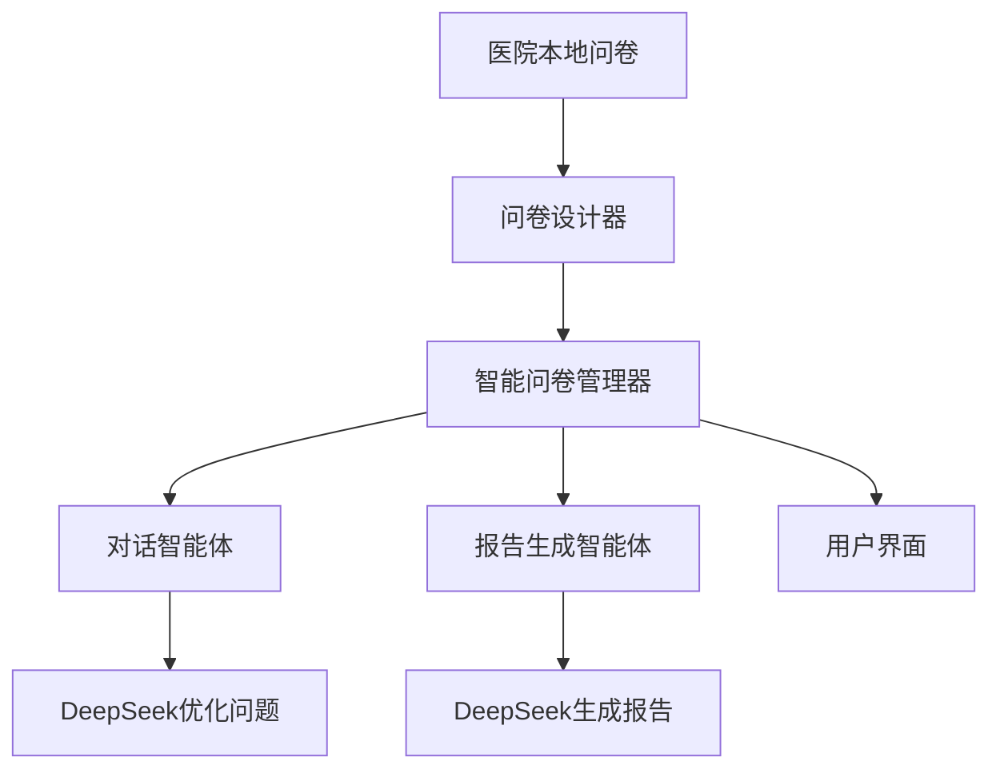

# 🏥 简化版智能问卷系统使用指南

## 📋 系统概述

基于医院提供的本地问卷，使用DeepSeek和多个智能体完成智能调研的简化系统。

### 🎯 核心特性

- **基于医院问卷** - 直接使用医院提供的专业问卷
- **DeepSeek优化** - 使用DeepSeek优化问题表述，使其更自然友好
- **多智能体配合** - 问卷设计、问题优化、报告生成分工合作
- **智能输入验证** - 自动验证用户回答的有效性
- **支持重新回答** - 用户可以重新回答之前的问题
- **自动生成报告** - 基于回答自动生成专业的医学报告

## 🏗️ 系统架构



## 🚀 快速开始

### 1. 集成到app.py

```python
# 在app.py中添加
from metagpt_questionnaire.simple_app_integration import setup_simple_questionnaire_routes

# 设置路由
setup_simple_questionnaire_routes(app, _run_async, generate_tts_audio, shorten_for_avatar, report_manager)
```

### 2. 前端API调用

#### 启动问卷
```javascript
// 启动智能问卷
const response = await fetch('/api/simple_questionnaire/start', {
    method: 'POST',
    headers: {'Content-Type': 'application/json'},
    body: JSON.stringify({
        session_id: 'user_001',
        local_questionnaire_path: '/path/to/hospital_questionnaire.py'
    })
});

const data = await response.json();
if (data.is_complete) {
    // 问卷完成，显示报告
    showReport(data.question);
} else {
    // 显示下一个问题
    showQuestion(data.question);
}
```

#### 提交答案
```javascript
// 提交答案
const response = await fetch('/api/simple_questionnaire/reply', {
    method: 'POST',
    headers: {'Content-Type': 'application/json'},
    body: JSON.stringify({
        session_id: 'user_001',
        answer: userAnswer
    })
});

const data = await response.json();
if (data.invalid_answer) {
    // 答案无效，重新询问
    showError(data.invalid_reason);
} else if (data.is_complete) {
    // 问卷完成
    showReport(data.question);
} else {
    // 继续下一个问题
    showQuestion(data.question);
}
```

## 🔧 核心组件

### 1. 智能问卷管理器 (`SimpleQuestionnaireManager`)

```python
class SimpleQuestionnaireManager:
    """简化版智能问卷管理器"""
    
    def initialize_questionnaire(self, questionnaire: Questionnaire) -> bool:
        """初始化问卷"""
    
    async def get_next_question(self, user_answer: Optional[str] = None) -> Dict[str, Any]:
        """获取下一个问题"""
    
    def _validate_answer(self, answer: str, question: Question) -> tuple[bool, str]:
        """验证用户回答"""
```

### 2. 对话智能体 (`ConversationalInterviewerAgent`)

```python
async def _optimize_question_with_llm(self, question: str, conversation_history: List[Dict], question_category: str) -> str:
    """使用DeepSeek优化问题表述"""
```

### 3. 报告生成智能体 (`ReportGeneratorAgent`)

```python
async def _generate_report_with_llm(self, questionnaire, answered_questions, conversation_history) -> str:
    """使用DeepSeek生成报告"""
```

## 📊 API接口

### 启动问卷
- **URL**: `POST /api/simple_questionnaire/start`
- **参数**: 
  - `session_id`: 会话ID
  - `local_questionnaire_path`: 医院问卷文件路径
- **返回**: 第一个问题或错误信息

### 提交答案
- **URL**: `POST /api/simple_questionnaire/reply`
- **参数**:
  - `session_id`: 会话ID
  - `answer`: 用户回答
- **返回**: 下一个问题、完成状态或错误信息

### 获取进度
- **URL**: `GET /api/simple_questionnaire/progress`
- **参数**: `session_id`
- **返回**: 问卷进度信息

### 重置会话
- **URL**: `POST /api/simple_questionnaire/reset`
- **参数**: `session_id`
- **返回**: 重置结果

## 🎯 使用流程

### 1. 问卷启动流程
```
用户请求 → 加载医院问卷 → 初始化管理器 → 获取第一个问题 → 优化问题表述 → 返回给用户
```

### 2. 问答流程
```
用户回答 → 验证答案 → 记录回答 → 获取下一个问题 → 优化问题表述 → 返回给用户
```

### 3. 完成流程
```
所有问题完成 → 生成报告 → 保存报告 → 返回报告给用户
```

## 🔍 智能特性

### 1. 问题优化
- 使用DeepSeek将医院问卷的正式问题转换为自然对话
- 考虑对话历史，使问题更连贯
- 根据问题分类调整表述方式

### 2. 输入验证
- 检查回答是否为空
- 验证回答长度和内容
- 提供具体的错误提示

### 3. 报告生成
- 使用DeepSeek基于问答生成专业医学报告
- 包含风险评估和医学建议
- 提供备用报告生成方案

## 🛠️ 配置说明

### 1. 医院问卷格式
```python
# 医院问卷文件应包含 questions_structured 列表
questions_structured = [
    {
        "id": "question_1",
        "text": "问题文本",
        "prompt": "对用户友好的问题表述",
        "category": "问题分类",
        "required": True
    },
    # ... 更多问题
]
```

### 2. DeepSeek配置
确保在 `metagpt_config.py` 中正确配置DeepSeek API：
```python
DEEPSEEK_API_KEY = "your_api_key"
DEEPSEEK_BASE_URL = "https://api.deepseek.com"
```

## 📈 优势特点

### 1. 简化架构
- 删除了复杂的统一管理器
- 专注于核心功能
- 易于维护和扩展

### 2. 基于医院问卷
- 直接使用医院专业问卷
- 保证问题的专业性和准确性
- 符合医学标准

### 3. 智能优化
- 使用DeepSeek优化问题表述
- 提供自然的对话体验
- 生成专业的医学报告

### 4. 用户友好
- 支持输入验证和错误提示
- 可以重新回答问题
- 提供清晰的进度反馈

## 🚨 注意事项

1. **医院问卷格式** - 确保医院问卷文件包含 `questions_structured` 列表
2. **DeepSeek配置** - 确保DeepSeek API配置正确
3. **错误处理** - 系统包含多层错误处理和降级方案
4. **会话管理** - 每个会话独立管理，支持并发使用

## 🎉 总结

这个简化版智能问卷系统专注于核心功能，基于医院专业问卷，使用DeepSeek和多个智能体提供智能调研体验。系统架构简单清晰，易于维护和扩展，能够满足医院调研的实际需求。
