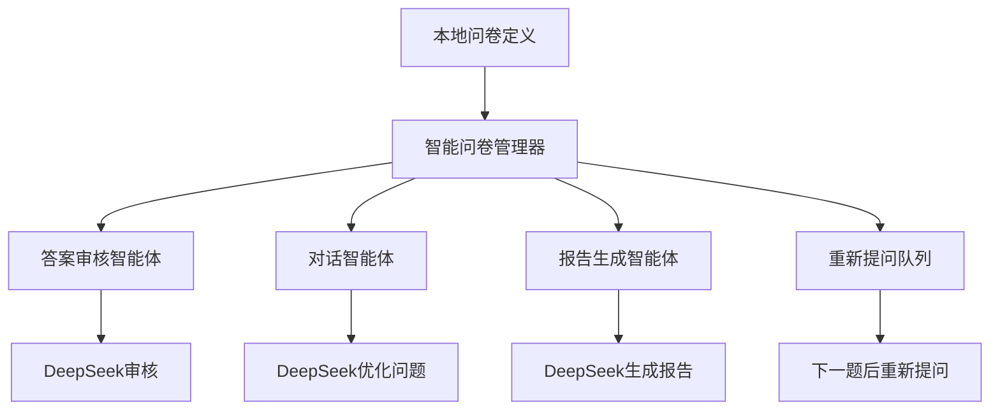

# 🧠 智能问卷系统使用指南

## 📋 系统概述

基于您的需求，我重新设计了一个更加可控的智能问卷系统：
- **本地书写问卷** - 直接在代码中定义问卷，完全可控
- **智能答案审核** - 使用DeepSeek审核答案质量
- **重新提问机制** - 审核不通过时在下一题后重新提问
- **问题优化** - 使用DeepSeek优化问题表述

## 🏗️ 系统架构



## 🎯 核心特性

### 1. **本地问卷定义**
```python
# 在 local_questionnaire_simple.py 中直接定义
QUESTIONS = [
    {
        "id": "name",
        "text": "姓名",
        "prompt": "请问怎么称呼您？",
        "category": "基本信息",
        "required": True,
        "validation": "姓名不能为空，请输入真实姓名"
    },
    # ... 更多问题
]
```

### 2. **智能答案审核**
- 基本验证：检查空值、长度、选项等
- DeepSeek审核：检查完整性、相关性、具体性、逻辑性
- 质量评分：0.0-1.0的评分系统

### 3. **智能跳题机制**
- 基于用户回答自动跳过不相关的问题
- 例如：回答"不吸烟"时自动跳过所有吸烟相关问题
- 支持多级依赖关系（如戒烟年数依赖戒烟状态）

### 4. **重新提问机制**
- 审核不通过的问题加入重试队列
- 在下一题回答完成后重新提问
- 提供具体的改进建议

### 5. **问题优化**
- 使用DeepSeek将问题转换为自然对话
- 考虑对话历史，使问题更连贯
- 重新提问时提供更友好的表述

## 🚀 快速开始

### 1. 集成到app.py

```python
# 在app.py中添加
from metagpt_questionnaire.smart_app_integration import setup_smart_questionnaire_routes

# 设置路由
setup_smart_questionnaire_routes(app, _run_async, generate_tts_audio, shorten_for_avatar, report_manager)
```

### 2. 前端API调用

#### 启动问卷
```javascript
const response = await fetch('/api/smart_questionnaire/start', {
    method: 'POST',
    headers: {'Content-Type': 'application/json'},
    body: JSON.stringify({
        session_id: 'user_001'
    })
});

const data = await response.json();
if (data.retry) {
    // 需要重新回答
    showRetryQuestion(data.question, data.retry_reason, data.suggestion);
} else {
    // 正常问题
    showQuestion(data.question);
}
```

#### 提交答案
```javascript
const response = await fetch('/api/smart_questionnaire/reply', {
    method: 'POST',
    headers: {'Content-Type': 'application/json'},
    body: JSON.stringify({
        session_id: 'user_001',
        answer: userAnswer
    })
});

const data = await response.json();
if (data.retry) {
    // 需要重新回答
    showRetryQuestion(data.question, data.retry_reason, data.suggestion);
} else if (data.is_complete) {
    // 问卷完成
    showReport(data.question);
} else {
    // 继续下一个问题
    showQuestion(data.question);
}
```

## 🔧 核心组件

### 1. 本地问卷定义 (`local_questionnaire_simple.py`)

```python
QUESTIONS = [
    {
        "id": "question_id",
        "text": "问题文本",
        "prompt": "对用户友好的问题表述",
        "category": "问题分类",
        "required": True,  # 是否必答
        "options": ["选项1", "选项2"],  # 可选选项
        "validation": "验证错误提示",
        "depends_on": {"id": "other_question", "value": "yes"}  # 依赖条件
    }
]
```

**跳题配置示例**:
```python
# 吸烟相关问题配置
{
    "id": "smoking_history",
    "text": "是否有吸烟史",
    "prompt": "请问您有吸烟的习惯吗？",
    "options": ["是", "否"],
    "required": True
},
{
    "id": "smoking_freq",
    "text": "吸烟频率(支/天)",
    "prompt": "您平均每天抽多少支烟？",
    "depends_on": {"id": "smoking_history", "value": "是"},  # 只有回答"是"才问
    "required": False
},
{
    "id": "smoking_quit_years",
    "text": "戒烟年数",
    "prompt": "您戒烟多少年了？",
    "depends_on": {"id": "smoking_quit", "value": "是"},  # 多级依赖
    "required": False
}
```

### 2. 答案审核智能体 (`AnswerValidatorAgent`)

```python
async def validate_answer(self, question_text, user_answer, question_category, validation_rules):
    # 基本验证
    basic_check = self._basic_validation(user_answer, validation_rules)
    
    # DeepSeek智能审核
    llm_validation = await self._llm_validation(question_text, user_answer, question_category)
    
    return {
        "status": "valid/invalid",
        "valid": True/False,
        "reason": "审核原因",
        "suggestion": "改进建议"
    }
```

### 3. 智能问卷管理器 (`SmartQuestionnaireManager`)

```python
class SmartQuestionnaireManager:
    def __init__(self):
        self.answered_questions = []  # 已回答的问题
        self.pending_retry_questions = []  # 待重新提问的问题
    
    async def get_next_question(self, user_answer=None):
        # 处理用户回答
        if user_answer:
            await self._process_user_answer(user_answer)
        
        # 检查重试队列
        if self.pending_retry_questions:
            return await self._handle_retry_question()
        
        # 获取下一个问题
        return await self._get_next_question()
```

## 📊 API接口

### 启动问卷
- **URL**: `POST /api/smart_questionnaire/start`
- **参数**: `session_id`
- **返回**: 第一个问题或错误信息

### 提交答案
- **URL**: `POST /api/smart_questionnaire/reply`
- **参数**: `session_id`, `answer`
- **返回**: 下一个问题、重试问题或完成状态

### 获取进度
- **URL**: `GET /api/smart_questionnaire/progress`
- **参数**: `session_id`
- **返回**: 问卷进度信息

### 重置会话
- **URL**: `POST /api/smart_questionnaire/reset`
- **参数**: `session_id`
- **返回**: 重置结果

## 🎯 使用流程

### 1. 正常问答流程
```
用户回答 → 基本验证 → DeepSeek审核 → 审核通过 → 记录答案 → 下一题
```

### 2. 重新提问流程
```
用户回答 → 基本验证 → DeepSeek审核 → 审核不通过 → 加入重试队列 → 下一题 → 重新提问
```

### 3. 完成流程
```
所有问题完成 → 生成报告 → 返回报告给用户
```

## 🔍 智能特性

### 1. 智能跳题
- **条件依赖**: 基于用户回答自动跳过不相关的问题
- **多级依赖**: 支持复杂的依赖关系链
- **智能判断**: 实时评估问题是否应该被问
- **日志记录**: 详细记录跳题原因和逻辑

**跳题示例**:
```python
# 当用户回答"不吸烟"时，自动跳过：
# - smoking_freq (吸烟频率)
# - smoking_years (吸烟年数) 
# - smoking_quit (是否戒烟)
# - smoking_quit_years (戒烟年数)
```

### 2. 答案审核
- **完整性检查**: 确保回答完整回答了问题
- **相关性检查**: 确保回答与问题相关
- **具体性检查**: 确保回答具体明确
- **逻辑性检查**: 确保回答符合逻辑
- **医学合理性**: 确保回答符合医学常识

### 3. 问题优化
- 将正式问题转换为自然对话
- 考虑对话历史，使问题更连贯
- 重新提问时提供更友好的表述

### 4. 重新提问机制
- 智能判断是否需要重新提问
- 提供具体的改进建议
- 在合适的时机重新提问

## 🛠️ 配置说明

### 1. 问卷配置
在 `local_questionnaire_simple.py` 中直接编辑：
- 问题内容
- 验证规则
- 依赖关系
- 选项限制

### 2. DeepSeek配置
确保在 `metagpt_config.py` 中正确配置：
```python
DEEPSEEK_API_KEY = "your_api_key"
DEEPSEEK_BASE_URL = "https://api.deepseek.com"
```

## 📈 优势特点

### 1. 完全可控
- 问卷内容完全由您控制
- 智能体只负责审核和优化
- 易于修改和维护

### 2. 智能审核
- 使用DeepSeek进行智能审核
- 确保答案质量和完整性
- 提供具体的改进建议

### 3. 用户友好
- 支持重新提问机制
- 提供清晰的错误提示
- 优化的问题表述

### 4. 高效流程
- 在下一题后重新提问
- 避免打断正常流程
- 提高用户体验

## 🚨 注意事项

1. **问卷定义** - 确保在 `local_questionnaire_simple.py` 中正确定义问卷
2. **DeepSeek配置** - 确保DeepSeek API配置正确
3. **错误处理** - 系统包含完善的错误处理和降级机制
4. **会话管理** - 每个会话独立管理，支持并发使用

## 🎉 总结

这个智能问卷系统完全基于您的需求设计：
- **本地书写问卷** - 完全可控，易于修改
- **智能答案审核** - 使用DeepSeek确保答案质量
- **重新提问机制** - 在下一题后重新提问，提高用户体验
- **问题优化** - 使用DeepSeek优化问题表述

系统架构简单清晰，功能强大，完全满足您的需求！🚀
