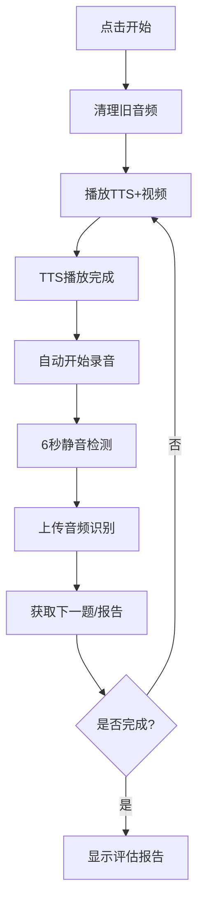

# 肺癌早筛智能体（Zhipu + iFlytek）

[](https://www.python.org/)
[](https://flask.palletsprojects.com/)
[](https://docs.python.org/3/library/typing.html)
[](LICENSE)

> **版本信息**: 对外版本 1.0 | 内部版本 2.0 | 计划迭代 2.1

基于智谱AI与科大讯飞（ASR/TTS）的肺癌早筛问卷系统。当前版本默认禁用"数字人生成"，采用预录视频 + 讯飞TTS 实时播报；支持自动生成与保存评估报告、网页查看历史报告。

## 📋 目录

- [功能特性](#-功能特性)
- [快速开始](#-快速开始)
- [系统架构](#-系统架构)
- [使用指南](#-使用指南)
- [本地问卷模块](#-本地问卷模块)
- [API接口](#-api接口)
- [配置说明](#-配置说明)
- [故障排查](#-故障排查)
- [开发指南](#-开发指南)
- [变更日志](#-变更日志)

## ✨ 功能特性

### 🧠 智能对话
- **智谱AI对话**: 按问卷逐题提问，完成后输出评估报告
- **本地问卷**: 内置47个专业问题，本地生成风险评估报告
- **智能评估**: 基于多维度因素自动计算风险等级

### 🎤 语音交互
- **语音识别**: iFlytek IAT WebSocket，前端自动录音与静音检测
- **语音合成**: iFlytek TTS WebSocket，WAV→MP3（优先）
- **自动流程**: TTS播放完成后自动开始录音，6秒静音自动停止

### 📊 报告管理
- **自动生成**: 问卷完成后自动生成专业评估报告
- **智能保存**: 按姓名+手机号+时间戳命名，支持TXT/JSON格式
- **历史查看**: 网页端查看、下载、管理历史报告
- **一键清理**: 开始新问卷时自动清理旧音频文件

### 🔧 系统功能
- **健康检查**: `/api/asr/health` 输出系统状态
- **跨平台**: 支持Windows、macOS、Linux
- **响应式**: 支持PC和移动端访问

## 🚀 快速开始

### 环境要求

- **Python**: 3.9+（推荐）
- **FFmpeg**: 用于音频格式转换
- **网络**: 可访问外网（Zhipu与iFlytek服务）

### 安装步骤

1. **克隆项目**
```bash
git clone <repository-url>
cd feiaiagent_2.0
```

2. **安装依赖**
```bash
pip install -r requirements.txt
```

3. **配置环境**
```bash
# 复制环境变量模板
cp env_template.env .env

# 编辑 .env 文件，填入您的API密钥
```

4. **启动系统**
```bash
python app.py
```

5. **访问应用**
```
http://localhost:8080
```

## 🏗️ 系统架构

### 核心模块

```
feiaiagent_2.0/
├── 📁 核心应用
│   ├── app.py                    # Flask主应用与API路由
│   ├── config.py                 # 系统配置管理
│   ├── local_questionnaire.py    # 本地问卷管理模块 ✨
│   └── zhipu_agent.py           # 智谱AI集成
│
├── 🎤 语音处理
│   ├── xfyun_asr.py             # 讯飞语音识别
│   └── xfyun_tts.py             # 讯飞语音合成
│
├── 📊 报告管理
│   ├── report_manager.py         # 报告保存与管理
│   └── digital_human.py          # 数字人生成（可选）
│
├── 🌐 前端界面
│   ├── static/
│   │   ├── index.html            # 主页面
│   │   ├── script.js             # 交互逻辑
│   │   ├── style.css             # 样式文件
│   │   ├── video/                # 预录视频
│   │   └── tts/                  # TTS音频
│   └── report/                   # 报告存储
│
└── 📚 文档
    └── README.md                 # 项目说明（本文档）
```

### 技术栈

- **后端**: Flask + Python 3.9+
- **AI服务**: 智谱AI (Zhipu) + 科大讯飞 (iFlytek)
- **音频处理**: FFmpeg + Web Audio API
- **前端**: 原生JavaScript + CSS3 + HTML5
- **数据格式**: 支持多种音频格式 (Speex, WebM, MP3等)

## 📖 使用指南

### 基本操作流程

1. **选择模式**
   - 🧠 **智谱AI对话**: 智能问答，AI生成报告
   - 📋 **本地问卷**: 固定问题库，本地生成报告

2. **开始问卷**
   - 点击对应按钮启动
   - 系统自动播放问题语音
   - 语音结束后自动开始录音

3. **回答问题**
   - 对着麦克风回答问题
   - 6秒静音自动停止录音
   - 系统自动识别并提交

4. **获取报告**
   - 问卷完成后自动生成评估报告
   - 可在"历史报告"中查看和下载

### 前端交互流程



## 📋 本地问卷模块

### 🎯 模块概述

`local_questionnaire.py` 是一个专门管理本地问卷的独立模块，它将所有与本地问卷相关的功能从主配置文件中分离出来，便于管理和维护。

#### 设计目标
- **模块化**: 问卷功能完全独立，便于维护和扩展
- **类型安全**: 完整的类型注解，提高代码质量
- **向后兼容**: 保持原有接口不变，无需修改其他代码
- **易于测试**: 独立的模块便于单元测试

#### 主要特性
- 📝 **47个专业问题**: 覆盖肺癌早筛的各个维度
- 🏷️ **13个问题分类**: 系统化的问卷结构
- 🤖 **智能会话管理**: 自动跟踪问卷进度
- 📊 **风险评估算法**: 基于多因素自动计算风险等级
- ✅ **答案验证**: 实时格式检查和错误提示

### ✨ 核心功能

#### 1. 问卷配置管理
```python
from local_questionnaire import QUESTIONS, QUESTIONNAIRE_REFERENCE

# 获取问题列表
total_questions = len(QUESTIONS)  # 47

# 获取问题分类
categories = list(QUESTIONNAIRE_REFERENCE.keys())  # 13个分类
```

#### 2. 会话管理
```python
from local_questionnaire import QuestionnaireSession

# 创建新会话
session = QuestionnaireSession("user_123")

# 获取当前问题
current_question = session.get_current_question()

# 提交答案
session.submit_answer("张三")

# 移动到下一题
session.move_to_next()

# 检查是否完成
if session.is_completed():
    print("问卷已完成")
```

#### 3. 报告生成
```python
from local_questionnaire import generate_assessment_report

# 生成评估报告
answers = {"姓名": "张三", "性别(1男 2女)": "1"}
report = generate_assessment_report(answers)
```

#### 4. 答案验证
```python
from local_questionnaire import validate_answer

# 验证答案
is_valid, error_msg = validate_answer("性别(1男 2女)", "3")
if not is_valid:
    print(f"答案无效: {error_msg}")
```

### 🚀 快速开始

#### 基本导入
```python
# 导入核心功能
from local_questionnaire import (
    QUESTIONS,                    # 问题列表
    QUESTIONNAIRE_REFERENCE,     # 问题分类
    QuestionnaireSession,        # 会话管理
    generate_assessment_report,  # 报告生成
    validate_answer,             # 答案验证
    get_question_info,           # 问题信息
    get_questionnaire_summary    # 问卷概览
)
```

#### 创建问卷会话
```python
# 创建新会话
session = QuestionnaireSession("user_123")

# 检查会话状态
print(f"当前问题: {session.get_current_question()}")
print(f"进度: {session.get_progress()}")
print(f"已完成: {session.is_completed()}")
```

#### 问卷流程示例
```python
# 完整的问卷流程
while not session.is_completed():
    # 获取当前问题
    question = session.get_current_question()
    print(f"问题: {question}")
    
    # 获取问题信息
    info = session.get_question_info()
    print(f"分类: {info['category']}")
    print(f"格式: {info['format']}")
    
    # 获取用户答案（这里简化处理）
    answer = input("请输入答案: ")
    
    # 验证答案
    is_valid, error_msg = validate_answer(question, answer)
    if not is_valid:
        print(f"答案无效: {error_msg}")
        continue
    
    # 提交答案
    session.submit_answer(answer)
    
    # 移动到下一题
    session.move_to_next()

# 生成报告
report = generate_assessment_report(session.answers)
print(report)
```

### 🔌 API参考

#### 核心类

##### `QuestionnaireSession`

问卷会话管理类，负责跟踪问卷进度和用户答案。

**构造函数**
```python
QuestionnaireSession(session_id: str)
```

**方法列表**

| 方法 | 返回类型 | 描述 |
|------|----------|------|
| `get_current_question()` | `Optional[str]` | 获取当前问题文本 |
| `get_progress()` | `str` | 获取进度信息 (如 "1/47") |
| `submit_answer(answer: str)` | `bool` | 提交答案，返回是否成功 |
| `move_to_next()` | `bool` | 移动到下一题，返回是否成功 |
| `is_completed()` | `bool` | 检查问卷是否完成 |
| `get_question_info()` | `Optional[Dict]` | 获取当前问题详细信息 |

**属性列表**

| 属性 | 类型 | 描述 |
|------|------|------|
| `session_id` | `str` | 会话唯一标识 |
| `current_question_index` | `int` | 当前问题索引 |
| `answers` | `Dict[str, str]` | 用户答案字典 |
| `start_time` | `float` | 会话开始时间戳 |
| `completed` | `bool` | 是否已完成 |

#### 核心函数

##### `generate_assessment_report(answers: Dict[str, str]) -> str`

根据用户答案生成肺癌早筛风险评估报告。

**参数**
- `answers`: 用户答案字典，键为问题文本，值为答案

**返回值**
- 格式化的评估报告文本

**示例**
```python
answers = {
    "姓名": "张三",
    "性别(1男 2女)": "1",
    "吸烟史(1是 2否)": "1",
    "吸烟频率(支/天)": "20"
}

report = generate_assessment_report(answers)
print(report)
```

##### `validate_answer(question: str, answer: str) -> Tuple[bool, str]`

验证答案格式是否正确。

**参数**
- `question`: 问题文本
- `answer`: 用户答案

**返回值**
- `(是否有效, 错误信息)`

**验证规则**
- 性别: 必须是 "1" 或 "2"
- 文化程度: 必须是 1-9 之间的整数
- 身高: 必须在 100-250cm 之间
- 体重: 必须在 30-200kg 之间
- 吸烟频率: 必须在 0-100 支/天之间
- 年数: 必须在 0-80 年之间

##### `get_question_info(question_index: int) -> Optional[Dict[str, Any]]`

获取指定索引的问题信息。

**参数**
- `question_index`: 问题索引（从0开始）

**返回值**
- 问题信息字典，包含分类、格式、索引等

##### `get_questionnaire_summary() -> Dict[str, Any]`

获取问卷概览信息。

**返回值**
- 包含总问题数、分类、预计时间等的字典

### 📊 问题分类

问卷包含以下13个主要分类，共47个专业问题：

#### 1. 基本信息 (7题)
- 姓名、性别、出生年份、身份证号等
- 医保卡号、家庭医生、问卷调查人

#### 2. 身体指标 (2题)
- 身高(cm)、体重(kg)
- 自动计算BMI指数

#### 3. 社会信息 (2题)
- 职业、文化程度
- 文化程度采用1-9级分类

#### 4. 联系方式 (4题)
- 家庭地址、住宅电话、手机号、家属电话
- 支持固话和手机号格式

#### 5. 吸烟史 (5题)
- 吸烟史、频率、年数、戒烟状态
- 自动计算包年数，评估风险等级

#### 6. 被动吸烟 (3题)
- 被动吸烟情况、频率、年数
- 评估二手烟暴露风险

#### 7. 厨房油烟 (2题)
- 油烟接触频率、累计年数
- 评估烹饪油烟暴露

#### 8. 职业暴露 (2题)
- 致癌物质接触、类型和年数
- 评估职业健康风险

#### 9. 肿瘤相关史 (4题)
- 个人肿瘤史、家族肿瘤史
- 记录肿瘤类型和确诊时间

#### 10. 影像检查 (1题)
- 胸部CT检查情况
- 评估影像学检查需求

#### 11. 呼吸系统疾病史 (10题)
- 慢性支气管炎、肺气肿、肺结核等
- 记录患病年数和严重程度

#### 12. 近期症状 (4题)
- 消瘦、咳嗽、痰中带血等
- 评估近期健康状态

#### 13. 健康自评 (1题)
- 自我健康感觉评估
- 1-3级主观评价

### 🧮 风险评估逻辑

#### 风险因素评分

| 风险因素 | 分值范围 | 说明 |
|----------|----------|------|
| **吸烟史** | 1-3分 | 根据包年数：轻度1分，中度2分，重度3分 |
| **被动吸烟** | 1分 | 存在被动吸烟情况 |
| **职业暴露** | 2分 | 存在职业致癌物质接触 |
| **家族史** | 2分 | 存在肺癌家族史 |
| **症状** | 3分 | 存在可疑症状 |

#### 风险等级划分

| 风险等级 | 分值范围 | 建议措施 | 图标 |
|----------|----------|----------|------|
| **低风险** | 0-2分 | 保持健康生活方式，定期体检 | 🟢 |
| **中风险** | 3-5分 | 建议定期体检，关注症状变化 | 🟡 |
| **高风险** | ≥6分 | 建议立即就医，进行详细检查 | 🔴 |

#### 包年数计算

```python
# 包年数 = (吸烟年数 × 每日支数) ÷ 20
pack_years = (years * daily_cigarettes) / 20

if pack_years > 30:
    risk_score += 3  # 重度吸烟
elif pack_years > 20:
    risk_score += 2  # 中度吸烟
else:
    risk_score += 1  # 轻度吸烟
```

### 📝 使用示例

#### 完整问卷流程
```python
from local_questionnaire import QuestionnaireSession, generate_assessment_report

def run_questionnaire():
    # 1. 创建会话
    session = QuestionnaireSession("user_123")
    
    print("=== 肺癌早筛问卷开始 ===")
    print(f"总问题数: {len(QUESTIONS)}")
    
    # 2. 问卷循环
    while not session.is_completed():
        # 获取当前问题
        question = session.get_current_question()
        info = session.get_question_info()
        
        print(f"\n[{session.get_progress()}] {question}")
        print(f"分类: {info['category']}")
        print(f"格式要求: {info['format']}")
        
        # 获取用户答案
        while True:
            answer = input("请输入答案: ").strip()
            
            # 验证答案
            is_valid, error_msg = validate_answer(question, answer)
            if is_valid:
                break
            else:
                print(f"❌ {error_msg}，请重新输入")
        
        # 提交答案
        session.submit_answer(answer)
        
        # 移动到下一题
        session.move_to_next()
    
    # 3. 生成报告
    print("\n=== 问卷完成，生成评估报告 ===")
    report = generate_assessment_report(session.answers)
    print(report)
    
    return session.answers

# 运行问卷
answers = run_questionnaire()
```

#### 批量答案验证
```python
from local_questionnaire import validate_answer, QUESTIONS

def validate_all_answers(answers_dict):
    """验证所有答案的格式"""
    validation_results = {}
    
    for question in QUESTIONS:
        if question in answers_dict:
            answer = answers_dict[question]
            is_valid, error_msg = validate_answer(question, answer)
            validation_results[question] = {
                "answer": answer,
                "is_valid": is_valid,
                "error_msg": error_msg
            }
        else:
            validation_results[question] = {
                "answer": None,
                "is_valid": False,
                "error_msg": "答案缺失"
            }
    
    return validation_results

# 验证示例
sample_answers = {
    "姓名": "张三",
    "性别(1男 2女)": "1",
    "身高(cm)": "175",
    "体重(kg)": "70"
}

results = validate_all_answers(sample_answers)
for question, result in results.items():
    status = "✅" if result["is_valid"] else "❌"
    print(f"{status} {question}: {result['answer']} - {result['error_msg']}")
```

#### 问卷统计分析
```python
from local_questionnaire import get_questionnaire_summary, QUESTIONNAIRE_REFERENCE

def analyze_questionnaire():
    """分析问卷结构和统计信息"""
    summary = get_questionnaire_summary()
    
    print("=== 问卷统计分析 ===")
    print(f"总问题数: {summary['total_questions']}")
    print(f"问题分类数: {len(summary['categories'])}")
    print(f"预计完成时间: {summary['estimated_time']}")
    print(f"问卷描述: {summary['description']}")
    
    print("\n=== 分类详情 ===")
    for category, questions_dict in QUESTIONNAIRE_REFERENCE.items():
        question_count = len(questions_dict)
        print(f"{category}: {question_count} 题")
        
        # 显示该分类下的问题示例
        sample_questions = list(questions_dict.keys())[:3]
        for question in sample_questions:
            format_guide = questions_dict[question]
            print(f"  - {question} ({format_guide})")

# 运行分析
analyze_questionnaire()
```

### 🔧 扩展指南

#### 添加新问题

1. **在问题列表中添加**
```python
# 在 QUESTIONS 列表末尾添加
QUESTIONS.append("新问题文本")
```

2. **在分类中添加格式要求**
```python
# 在 QUESTIONNAIRE_REFERENCE 中添加
QUESTIONNAIRE_REFERENCE["新分类"]["新问题文本"] = "格式要求说明"
```

3. **添加验证规则**
```python
# 在 validate_answer 函数中添加
def validate_answer(question: str, answer: str) -> Tuple[bool, str]:
    # 现有验证逻辑...
    
    # 添加新规则
    if "新问题关键词" in question:
        # 自定义验证逻辑
        if not answer.isdigit():
            return False, "请输入数字"
        if int(answer) < 0 or int(answer) > 100:
            return False, "数值应在0-100之间"
    
    return True, ""
```

#### 修改报告模板

```python
def generate_assessment_report(answers: Dict[str, str]) -> str:
    # 现有报告生成逻辑...
    
    # 添加新的评估维度
    if "新问题" in answers:
        new_answer = answers["新问题"]
        report += f"\n【新评估维度】\n"
        report += f"新问题答案: {new_answer}\n"
        
        # 添加新的风险评估逻辑
        if new_answer == "高风险值":
            report += "⚠️ 新风险因素: 需要关注\n"
    
    return report
```

#### 自定义会话管理

```python
class CustomQuestionnaireSession(QuestionnaireSession):
    """扩展的问卷会话管理类"""
    
    def __init__(self, session_id: str, custom_config: Dict = None):
        super().__init__(session_id)
        self.custom_config = custom_config or {}
        self.custom_metrics = {}
    
    def get_custom_progress(self) -> Dict[str, Any]:
        """获取自定义进度信息"""
        return {
            "standard_progress": self.get_progress(),
            "custom_metrics": self.custom_metrics,
            "estimated_time": self._estimate_remaining_time()
        }
    
    def _estimate_remaining_time(self) -> str:
        """估算剩余时间"""
        remaining_questions = len(QUESTIONS) - self.current_question_index
        estimated_minutes = remaining_questions * 0.5  # 假设每题0.5分钟
        return f"约{estimated_minutes:.1f}分钟"
```

### 🧪 测试说明

#### 运行测试

```bash
# 直接运行模块进行测试
python local_questionnaire.py
```

#### 测试输出示例

```
=== 本地问卷模块测试 ===
总问题数: 47
问题分类: ['基本信息', '身体指标', '社会信息', '联系方式', '吸烟史', '被动吸烟', '厨房油烟', '职业暴露', '肿瘤相关史', '影像检查', '呼吸系统疾病史', '近期症状', '健康自评']

当前问题: 姓名
进度: 1/47

生成的报告长度: 361 字符
报告预览:
肺癌早筛风险评估报告

==================================================

【基本信息】
姓名：张三
性别：男
出生年份：1980
身高：175.0cm，体重：70.0kg，BMI：22.9

【风险评估】
⚠️ 吸烟史：有吸烟史，增加肺癌风险
   轻度吸烟：15.0包年，低风险

【总体评估】
🟢 低风险：保持健康生活方式，定期体检

【建议措施】
1. 戒烟限酒，避免二手烟
2. 保持室内通风，减少油烟接触
3. 定期体检，关注肺部健康
4. 如有异常症状，及时就医
5. 保持健康生活方式，适量运动

==================================================
...
```

#### 单元测试

```python
import unittest
from local_questionnaire import (
    QuestionnaireSession, 
    generate_assessment_report,
    validate_answer
)

class TestQuestionnaireModule(unittest.TestCase):
    
    def setUp(self):
        self.session = QuestionnaireSession("test_session")
    
    def test_session_creation(self):
        """测试会话创建"""
        self.assertEqual(self.session.session_id, "test_session")
        self.assertEqual(self.session.current_question_index, 0)
        self.assertFalse(self.session.completed)
    
    def test_question_progression(self):
        """测试问题进度"""
        self.assertEqual(self.session.get_progress(), "1/47")
        self.session.move_to_next()
        self.assertEqual(self.session.get_progress(), "2/47")
    
    def test_answer_validation(self):
        """测试答案验证"""
        # 测试性别验证
        is_valid, error_msg = validate_answer("性别(1男 2女)", "1")
        self.assertTrue(is_valid)
        
        is_valid, error_msg = validate_answer("性别(1男 2女)", "3")
        self.assertFalse(is_valid)
        self.assertIn("1(男)或2(女)", error_msg)
    
    def test_report_generation(self):
        """测试报告生成"""
        answers = {"姓名": "测试用户", "性别(1男 2女)": "1"}
        report = generate_assessment_report(answers)
        self.assertIn("测试用户", report)
        self.assertIn("肺癌早筛风险评估报告", report)

if __name__ == "__main__":
    unittest.main()
```

## 🔌 API接口

### 核心接口

| 方法 | 接口 | 描述 |
|------|------|------|
| `POST` | `/api/agent/start` | 启动智谱AI问卷 |
| `POST` | `/api/agent/reply` | 提交回答，获取下一题 |
| `POST` | `/api/local_questionnaire/start` | 启动本地问卷 |
| `POST` | `/api/local_questionnaire/reply` | 提交本地问卷回答 |
| `POST` | `/api/asr` | 语音识别接口 |

### 报告管理接口

| 方法 | 接口 | 描述 |
|------|------|------|
| `GET` | `/api/reports` | 获取报告列表与统计 |
| `GET` | `/api/reports/content/<filename>` | 读取报告内容 |
| `GET` | `/api/reports/download/<filename>` | 下载报告文件 |

### 系统接口

| 方法 | 接口 | 描述 |
|------|------|------|
| `GET` | `/api/health` | 系统健康检查 |
| `GET` | `/api/asr/health` | ASR系统状态 |
| `GET` | `/api/questionnaire_status` | 问卷系统状态 |

### 响应格式示例

```json
{
  "session_id": "1234567890",
  "question": "请告诉我您的姓名",
  "tts_url": "/static/tts/session_123.mp3",
  "video_url": "/static/video/human.mp4",
  "is_complete": false,
  "progress": "1/47"
}
```

## ⚙️ 配置说明

### 环境变量配置

```env
# 智谱AI配置
ZHIPU_APP_ID=your_app_id
ZHIPU_API_KEY=your_api_key
ZHIPU_API_MODE=open_app_v3

# 科大讯飞配置
XFYUN_APPID=your_appid
XFYUN_APIKEY=your_apikey
XFYUN_APISECRET=your_apisecret

# 系统配置
FFMPEG_PATH=C:\\ffmpeg\\bin\\ffmpeg.exe
LOG_LEVEL=INFO
```

### 平台特定配置

#### Windows
```powershell
# 设置FFmpeg路径
$env:FFMPEG_PATH="C:\ffmpeg\bin\ffmpeg.exe"

# 或添加到系统PATH
# 将 C:\ffmpeg\bin 添加到系统环境变量PATH
```

#### macOS
```bash
# 安装FFmpeg
brew install ffmpeg

# 验证安装
ffmpeg -version
```

#### Linux
```bash
# Ubuntu/Debian
sudo apt-get install ffmpeg

# CentOS/RHEL
sudo yum install ffmpeg

# 验证安装
ffmpeg -version
```

## 🔧 故障排查

### 常见问题

#### 1. TTS/ASR失败
**症状**: 语音无法播放或识别失败
**排查步骤**:
1. 检查讯飞API配置是否正确
2. 确认网络连接正常
3. 查看终端日志输出
4. 检查API密钥是否有效

#### 2. 音频无法播放
**症状**: 浏览器无法播放TTS音频
**排查步骤**:
1. 确认生成了MP3文件
2. 检查浏览器音频权限
3. 查看`/static/tts`目录
4. 尝试手动播放音频文件

#### 3. ASR识别失败
**症状**: 语音识别结果为空或错误
**排查步骤**:
1. 检查录音音量是否足够
2. 确认FFmpeg正常工作
3. 验证音频格式转换
4. 检查网络连接状态

### 日志分析

系统提供详细的日志输出，关键信息包括：
- API调用状态
- 音频处理过程
- 错误详情和堆栈
- 性能指标统计

### 性能优化

- **音频缓存**: 自动清理旧文件
- **连接复用**: WebSocket连接优化
- **异步处理**: 非阻塞操作
- **内存管理**: 及时释放资源

## 👨‍💻 开发指南

### 项目结构说明

- **`app.py`**: 主应用入口，包含所有API路由
- **`local_questionnaire.py`**: 本地问卷管理模块（新增）
- **`config.py`**: 系统配置和工具路径管理
- **`zhipu_agent.py`**: 智谱AI服务集成
- **`xfyun_asr.py`**: 讯飞语音识别实现
- **`xfyun_tts.py`**: 讯飞语音合成实现
- **`report_manager.py`**: 报告文件管理

### 扩展开发

#### 添加新问题
```python
# 在 local_questionnaire.py 中
QUESTIONS.append("新问题文本")

# 在 QUESTIONNAIRE_REFERENCE 中添加分类
QUESTIONNAIRE_REFERENCE["新分类"]["新问题文本"] = "格式要求"
```

#### 自定义验证规则
```python
# 在 validate_answer 函数中添加
def validate_answer(question: str, answer: str) -> Tuple[bool, str]:
    # 现有验证逻辑...
    
    # 添加新规则
    if "新问题关键词" in question:
        # 自定义验证逻辑
        pass
    
    return True, ""
```

#### 修改报告模板
```python
# 在 generate_assessment_report 函数中
def generate_assessment_report(answers: Dict[str, str]) -> str:
    # 现有报告生成逻辑...
    
    # 添加新的评估维度
    if "新问题" in answers:
        # 新的评估逻辑
        pass
    
    return report
```

### 测试指南

```bash
# 运行问卷模块测试
python local_questionnaire.py

# 启动应用进行集成测试
python app.py

# 访问测试页面
# http://localhost:8080
```

## 📝 变更日志

### 版本 2.0 (当前版本)

#### ✨ 新增功能
- 🆕 本地问卷管理模块 (`local_questionnaire.py`)
- 🆕 报告自动保存与历史管理
- 🆕 启动时自动清理旧音频文件
- 🆕 系统健康检查接口

#### 🔧 优化改进
- 🚀 优化ASR连接管理，减少断连
- 🎯 改进问卷进度跟踪
- 📱 增强移动端兼容性
- 🎨 优化用户界面体验

#### 🐛 问题修复
- 🐛 修复音频播放兼容性问题
- 🐛 解决Windows下FFmpeg路径问题
- 🐛 优化错误处理和用户提示

### 版本 1.0 (对外版本)

- 🎉 基础功能实现
- 🧠 智谱AI集成
- 🎤 讯飞语音服务
- 📊 基础报告生成

## 🗺️ 路线图

### 版本 2.1 (计划中)

#### 🔍 报告管理增强
- [ ] 报告筛选（姓名/手机号/日期）
- [ ] 报告删除接口
- [ ] 报告统计分析
- [ ] 批量导出功能

#### 🎤 语音功能优化
- [ ] ASR wpgs 增量字幕
- [ ] 前端实时字幕显示
- [ ] 可选TTS音色配置
- [ ] 语速调节功能

#### 🎨 用户体验提升
- [ ] 问卷进度可视化
- [ ] 答案实时验证
- [ ] 智能提示系统
- [ ] 多语言支持

#### 🔧 系统优化
- [ ] 性能监控面板
- [ ] 自动化测试
- [ ] 部署脚本
- [ ] 容器化支持

## 📄 许可证

本项目采用 MIT 许可证 - 查看 [LICENSE](LICENSE) 文件了解详情。

## 🤝 贡献指南

欢迎提交 Issue 和 Pull Request！

### 贡献方式

1. **报告问题**: 在GitHub上创建Issue
2. **功能建议**: 提交Feature Request
3. **代码贡献**: Fork项目并提交PR
4. **文档改进**: 帮助完善文档

### 开发规范

- 遵循PEP 8代码风格
- 添加适当的类型注解
- 编写清晰的文档字符串
- 包含必要的测试用例

## 📞 联系方式

- **项目地址**: [GitHub Repository]
- **问题反馈**: [GitHub Issues]
- **功能建议**: [GitHub Discussions]

---

**注意**: 本项目仅用于内部演示与研究，使用外部API时请遵守对应服务条款。

**最后更新**: 2025年1月

                                                        
